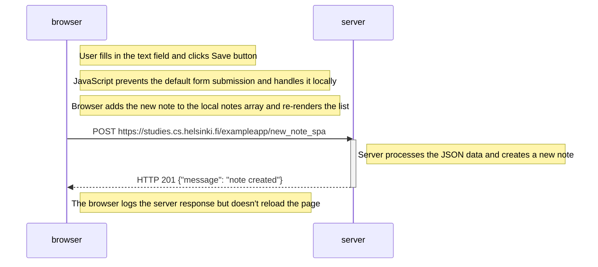

```mermaid
sequenceDiagram
    participant browser
    participant server

    Note right of browser: User fills in the text field and clicks Save button

    Note right of browser: JavaScript prevents the default form submission and handles it locally

    Note right of browser: Browser adds the new note to the local notes array and re-renders the list

    browser->>server: POST https://studies.cs.helsinki.fi/exampleapp/new_note_spa
    activate server
    Note right of server: Server processes the JSON data and creates a new note
    server-->>browser: HTTP 201 {"message": "note created"}
    deactivate server

    Note right of browser: The browser logs the server response but doesn't reload the page
```
